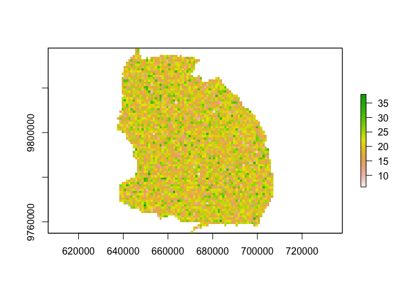

<!-- README.md is generated from README.Rmd. Please edit that file -->

# treerabid

*This is a work in progress that will break \| change \| may get
rehomed!*

`treerabid` reconstructs transmission trees using line list
data–specifically in the context of contact tracing data for canine
rabies in Tanzania for the Hampson Lab.

Based on: - [Hampsone et al. 2009. Transmission Dynamics and Prospects
for the Elimination of Canine
Rabies.](https://journals.plos.org/plosbiology/article?id=10.1371/journal.pbio.1000053)
- [Cori et al. 2019. A graph-based evidence synthesis approach to
detecting outbreak clusters: An application to dog
rabies.](https://journals.plos.org/ploscompbiol/article?id=10.1371/journal.pcbi.1006554)
- Mancy et al. in prep.

## Installation

Install from github with:

``` r
# install.packages("devtools")
devtools::install_github("mrajeev08/treerabid")
```

Dependencies: `data.table`, Suggests: `ggraph`, `ggplot2`, `igraph`,
`foreach`, `doRNG`, `parallel`

## Example using `treerabid` + `simrabid`

``` r
# Dependencies for simrabid
library(raster)
#> Loading required package: sp
library(data.table)
#> 
#> Attaching package: 'data.table'
#> The following object is masked from 'package:raster':
#> 
#>     shift
library(sf)
#> Linking to GEOS 3.8.1, GDAL 3.1.4, PROJ 6.3.1
library(tidyr)
#> 
#> Attaching package: 'tidyr'
#> The following object is masked from 'package:raster':
#> 
#>     extract
library(dplyr)
#> 
#> Attaching package: 'dplyr'
#> The following objects are masked from 'package:data.table':
#> 
#>     between, first, last
#> The following objects are masked from 'package:raster':
#> 
#>     intersect, select, union
#> The following objects are masked from 'package:stats':
#> 
#>     filter, lag
#> The following objects are masked from 'package:base':
#> 
#>     intersect, setdiff, setequal, union
library(magrittr)
#> 
#> Attaching package: 'magrittr'
#> The following object is masked from 'package:tidyr':
#> 
#>     extract
#> The following object is masked from 'package:raster':
#> 
#>     extract
library(ggplot2)
library(fasterize)
#> 
#> Attaching package: 'fasterize'
#> The following object is masked from 'package:graphics':
#> 
#>     plot
#> The following object is masked from 'package:base':
#> 
#>     plot
library(lubridate)
#> 
#> Attaching package: 'lubridate'
#> The following objects are masked from 'package:data.table':
#> 
#>     hour, isoweek, mday, minute, month, quarter, second, wday, week,
#>     yday, year
#> The following objects are masked from 'package:raster':
#> 
#>     intersect, union
#> The following objects are masked from 'package:base':
#> 
#>     date, intersect, setdiff, union

# Additional dependencies for treerabid
library(igraph)
#> 
#> Attaching package: 'igraph'
#> The following objects are masked from 'package:lubridate':
#> 
#>     %--%, union
#> The following objects are masked from 'package:dplyr':
#> 
#>     as_data_frame, groups, union
#> The following object is masked from 'package:tidyr':
#> 
#>     crossing
#> The following object is masked from 'package:raster':
#> 
#>     union
#> The following objects are masked from 'package:stats':
#> 
#>     decompose, spectrum
#> The following object is masked from 'package:base':
#> 
#>     union
library(ggraph)
#> 
#> Attaching package: 'ggraph'
#> The following object is masked from 'package:sp':
#> 
#>     geometry
library(foreach)
library(doRNG)
#> Loading required package: rngtools
library(doParallel)
#> Loading required package: iterators
#> Loading required package: parallel

# simrabid & treerabid
library(simrabid) # devtools::install_github("mrajeev08/simrabid")
library(treerabid)
```

First simulate from rabies IBM using `simrabid`:

``` r
# set up 
sd_shapefile <- st_read(system.file("extdata/sd_shapefile.shp", 
                                    package = "simrabid"))
#> Reading layer `sd_shapefile' from data source `/Library/Frameworks/R.framework/Versions/4.0/Resources/library/simrabid/extdata/sd_shapefile.shp' using driver `ESRI Shapefile'
#> Simple feature collection with 75 features and 12 fields
#> geometry type:  POLYGON
#> dimension:      XY
#> bbox:           xmin: 637186.6 ymin: 9754400 xmax: 707441.9 ymax: 9837887
#> projected CRS:  WGS 84 / UTM zone 36S

# 1. set up the space at 1000 m resolution
sd_shapefile$id_col <- 1:nrow(sd_shapefile)
out <- setup_space(shapefile = sd_shapefile, resolution = 1000, id_col = "id_col", 
                   use_fasterize = TRUE)
pop_out <- out
values(pop_out) <- rpois(ncell(pop_out), 20) # fake some population data
pop_out[is.na(out)] <- NA
plot(pop_out)
```



``` r
# 2. set-up simulation framework 
start_up <- setup_sim(start_date = "2002-01-01",
                      apprx_end_date = "2012-01-01", # apprx 10 years
                      days_in_step = 7, # weekly timestep
                      rast = out, 
                      death_rate_annual = 0.48, 
                      birth_rate_annual = 0.52,
                      waning_rate_annual = 1/3,
                      params = list(start_pop = pop_out[]), 
                      by_admin = FALSE)

# 3. Simulate vaccination
vacc_dt <- simrabid::sim_campaigns(locs = 1:75, campaign_prob = 0.7, 
                                   coverage = 0.4, sim_years = 10, 
                                   burn_in_years = 0,
                                   steps_in_year = 52)

# 4. Run the simulation
# see ?simrabid for more details on function arguments
system.time({
  set.seed(1244)
  exe <- simrabid(start_up, start_vacc = 0, I_seeds = 0,
                 vacc_dt = vacc_dt,
                 params = c(list(R0 = 1.1, k = 1, iota = 0.25),
                            param_defaults),
                 days_in_step = 7,
                 observe_fun = beta_detect_monthly,
                 serial_fun = serial_lognorm,
                 dispersal_fun = dispersal_lognorm,
                 secondary_fun = nbinom_constrained,
                 incursion_fun = sim_incursions_pois,
                 movement_fun = sim_movement_continuous,
                 sequential = FALSE, allow_invalid = TRUE,
                 leave_bounds = TRUE, max_tries = 100,
                 summary_fun = use_mget, 
                 track = FALSE,
                 weights = NULL,
                 row_probs = NULL,
                 coverage = TRUE,
                 break_threshold = 0.8, 
                 by_admin = FALSE) 
}
)
#>    user  system elapsed 
#>   5.468   0.440   6.701

# I_dt is the line list
case_dt <- exe$I_dt
head(case_dt)
#>    id cell_id row_id progen_id path  x_coord y_coord invalid outbounds
#> 1:  1    2054   1121        -1    0 660686.6 9808387   FALSE     FALSE
#> 2:  2    1058    384        -1    0 644686.6 9822387   FALSE     FALSE
#> 3:  3    1760    882        -1    0 646686.6 9812387   FALSE     FALSE
#> 4:  4     661    200        -1    0 667686.6 9828387   FALSE     FALSE
#> 5:  5    2137   1194        -1    0 673686.6 9807387   FALSE     FALSE
#> 6:  6    4758   3559         6    0 704712.1 9770376   FALSE     FALSE
#>    t_infected contact infected t_infectious month detect_prob detected
#> 1:    0.00000       N     TRUE     9.285714     2   0.8708125        1
#> 2:    0.00000       N     TRUE    12.000000     3   0.9285117        1
#> 3:    0.00000       N     TRUE    23.428571     5   0.9268917        1
#> 4:    0.00000       N     TRUE    26.571429     6   0.9739897        1
#> 5:    0.00000       N     TRUE    40.714286    10   0.8921821        1
#> 6:   47.85714       S     TRUE    50.740595    12   0.8711260        1
```

Reconstruct bootstrapped trees (per Hampson et al. 2009) & prune any
unlikely case pairs based on the distribution of distances between cases
and a pecentile cutoff (see Cori et al):

``` r
# turn time step to dates
case_dt$date <- as_date(duration(case_dt$t_infected, "weeks") + ymd("2002-01-1"))
# construct one tree
ttree <- 
        build_tree(id_case = case_dt$id,
                   id_biter = 0, # we don't know the progenitors 
                   x_coord = case_dt$x_coord,
                   y_coord = case_dt$y_coord,
                   owned = 0, 
                   date_symptoms = case_dt$date,
                   days_uncertain = 0,
                   use_known_source = FALSE,
                   prune = TRUE,
                   si_fun = si_gamma1,
                   dist_fun = dist_gamma1, 
                   params = params_treerabid, 
                   cutoff = 0.95)

# Bootstrapped trees in parallel & reproducible with doRNG
 ttrees <- 
        boot_trees(id_case = case_dt$id,
                   id_biter = 0, # we don't know the progenitors 
                   x_coord = case_dt$x_coord,
                   y_coord = case_dt$y_coord,
                   owned = 0, 
                   date_symptoms = case_dt$date,
                   days_uncertain = 0,
                   use_known_source = FALSE,
                   prune = TRUE,
                   si_fun = si_gamma1,
                   dist_fun = dist_gamma1, 
                   params = params_treerabid, 
                   cutoff = 0.95,
                   N = 5, 
                   seed = 105)
#> Warning: executing %dopar% sequentially: no parallel backend registered
```

## Visualizing trees

We can then visualize the consensus links:

For some links, given date uncertainties, we don’t know
who-infected-whom (i.e.  the loops in the tree).

How certain are these links:

Incursions are those that didn’t have any potential progenitor within
the cutoff time & distance. We can see the probability for each case
being an incursion (total and for those that were assigned as such):

We can also compute stats on the consensus tree (i.e. tree which
includes the highest % of consensus links):

And vizualize this tree over time and space:

# Customize it

Writing your own si and distance distribution functions:

Let’s pretend that we actually know some of these case pairs from
contact tracing data and reconstruct only unknown links:

## Some preliminary work re: estimating detection probabilities

Cori et al. 2019 use analytic expectations of temporal, spatial, genetic
distances between case pairs given a detection probability.

Working backwards from there, if we can link case pairs to get the
distribution of distances (genetic \| spatial \| temporal) between case
pairs, can we compare this to the analytical expectations to estimate
detection probabilities?

Right now, only one that really works in temporal:

``` r
# Line list full | 85% | 50% | 20% data & estimate detection 
```

Also the genetic data:

``` r
# Simplified assignment of lineages & snps 

# Line list with 25% | 10% | 5% data & estimate detection 
```

And this is using known case links, so really the *perfect* data,
i.e. if it doesn’t work in this context, it’s unlikely to work in real
data world. The real test here would be to simulat with known10.714
detection probability, reconstruct transmission tree, and then try to
recover the detection probability.

## Known limitations & future directions

-   Better incorporating uncertainty in contact tracing data to avoid
    creating loops & getting reasonable dates?
-   Incorporating uncertainty into location data?
-   Using N data streams with N uncertainties & N cutoffs/prob
    distributions
-   Using genetic data (SNPs between cases per Cori \| Lineage
    assignemnts)
-   Using partial data (i.e. incorporating genetic data when it is
    available)
-   Use simulations to validate the detection estimates
    -   Get the distance \| empirical bits working in the detection est
    -   Simulate from simrabid + reconstruct bootstrapped trees +
        estimate detection for each tree & compare to known estimate
    -   Combining data streams in this context?
