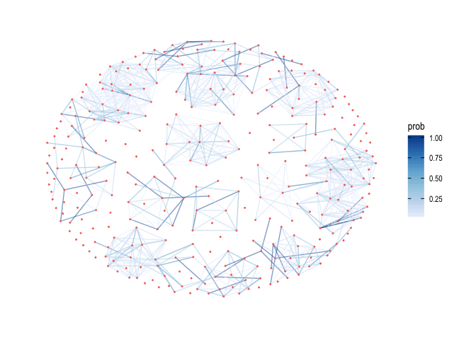
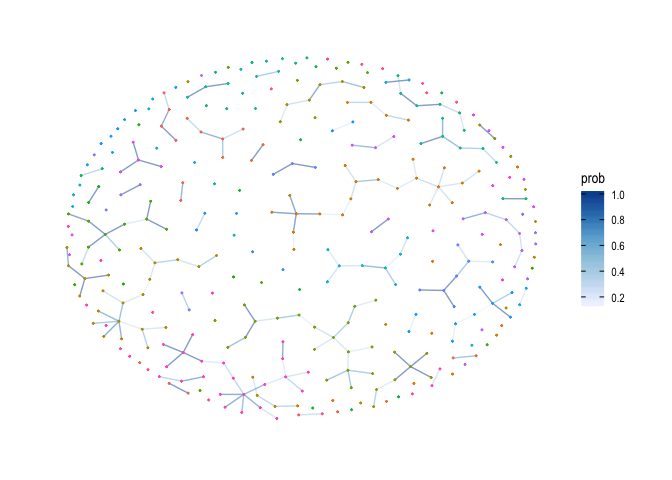
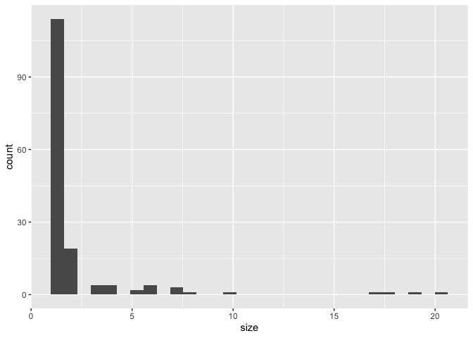
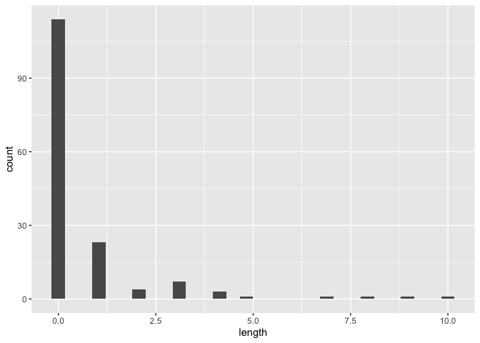

<!-- README.md is generated from README.Rmd. Please edit that file -->

# treerabid

*This is a work in progress that will break \| change \| may get
rehomed!*

`treerabid` reconstructs transmission trees using line list
data–specifically in the context of contact tracing data for canine
rabies in Tanzania for the Hampson Lab.

Based on: - [Hampson et al. 2009. Transmission Dynamics and Prospects
for the Elimination of Canine
Rabies.](https://journals.plos.org/plosbiology/article?id=10.1371/journal.pbio.1000053)
- [Cori et al. 2019. A graph-based evidence synthesis approach to
detecting outbreak clusters: An application to dog
rabies.](https://journals.plos.org/ploscompbiol/article?id=10.1371/journal.pcbi.1006554)
- Mancy et al. in prep.

## Installation

Install from github with:

``` r
# install.packages("devtools")
devtools::install_github("mrajeev08/treerabid")
```

Dependencies: `data.table`, `foreach`, `doRNG`, `parallel` Suggests:
`ggraph`, `ggplot2`, `igraph`

## Example using `treerabid` + `simrabid`

``` r
# Dependencies for simrabid
library(raster)
library(data.table)
library(sf)
library(tidyr)
library(dplyr)
library(magrittr)
library(ggplot2)
library(fasterize)
library(lubridate)

# Additional dependencies for treerabid
library(igraph)
library(ggraph)
library(foreach)
library(doRNG)
library(doParallel)

# simrabid & treerabid
library(simrabid) # devtools::install_github("mrajeev08/simrabid")
library(treerabid)
```

First simulate from rabies IBM using `simrabid`:

``` r
# set up 
sd_shapefile <- st_read(system.file("extdata/sd_shapefile.shp", 
                                    package = "simrabid"))
#> Reading layer `sd_shapefile' from data source `/Library/Frameworks/R.framework/Versions/4.0/Resources/library/simrabid/extdata/sd_shapefile.shp' using driver `ESRI Shapefile'
#> Simple feature collection with 75 features and 12 fields
#> geometry type:  POLYGON
#> dimension:      XY
#> bbox:           xmin: 637186.6 ymin: 9754400 xmax: 707441.9 ymax: 9837887
#> projected CRS:  WGS 84 / UTM zone 36S

# 1. set up the space at 1000 m resolution
sd_shapefile$id_col <- 1:nrow(sd_shapefile)
out <- setup_space(shapefile = sd_shapefile, resolution = 1000, id_col = "id_col", 
                   use_fasterize = TRUE)
pop_out <- out
values(pop_out) <- rpois(ncell(pop_out), 20) # fake some population data
pop_out[is.na(out)] <- NA
plot(pop_out)
```


``` r
# 2. set-up simulation framework 
start_up <- setup_sim(start_date = "2002-01-01",
                      apprx_end_date = "2012-01-01", # apprx 10 years
                      days_in_step = 7, # weekly timestep
                      rast = out, 
                      death_rate_annual = 0.48, 
                      birth_rate_annual = 0.52,
                      waning_rate_annual = 1/3,
                      params = list(start_pop = pop_out[]), 
                      by_admin = FALSE)

# 3. Simulate vaccination
vacc_dt <- simrabid::sim_campaigns(locs = 1:75, campaign_prob = 0.7, 
                                   coverage = 0.4, sim_years = 10, 
                                   burn_in_years = 0,
                                   steps_in_year = 52)

# 4. Run the simulation
# see ?simrabid for more details on function arguments
system.time({
  set.seed(1244)
  exe <- simrabid(start_up, start_vacc = 0, I_seeds = 0,
                 vacc_dt = vacc_dt,
                 params = c(list(R0 = 1.1, k = 1, iota = 0.25),
                            param_defaults),
                 days_in_step = 7,
                 observe_fun = beta_detect_monthly,
                 serial_fun = serial_lognorm,
                 dispersal_fun = dispersal_lognorm,
                 secondary_fun = nbinom_constrained,
                 incursion_fun = sim_incursions_pois,
                 movement_fun = sim_movement_continuous,
                 sequential = FALSE, allow_invalid = TRUE,
                 leave_bounds = TRUE, max_tries = 100,
                 summary_fun = use_mget, 
                 track = FALSE,
                 weights = NULL,
                 row_probs = NULL,
                 coverage = TRUE,
                 break_threshold = 0.8, 
                 by_admin = FALSE) 
}
)
#>    user  system elapsed 
#>   5.519   0.505   6.119

# I_dt is the line list
case_dt <- exe$I_dt
head(case_dt)
#>    id cell_id row_id progen_id path  x_coord y_coord invalid outbounds
#> 1:  1    4770   3569         1    0 646572.8 9768948   FALSE     FALSE
#> 2:  2    4771   3570         1    0 647683.1 9769405   FALSE     FALSE
#> 3:  3    4771   3570         1    0 647907.0 9769365   FALSE     FALSE
#> 4:  4    4936   3724         4    0 673186.3 9766966   FALSE     FALSE
#> 5:  5    4770   3569         1    0 646557.5 9768968   FALSE     FALSE
#> 6:  6    4840   3635         1    0 646752.4 9768735   FALSE     FALSE
#>    t_infected contact infected t_infectious month detect_prob detected
#> 1:   3.714286       S     TRUE     6.212036     1   0.8720671        1
#> 2:   3.714286       S     TRUE     7.292879     1   0.8720671        1
#> 3:   3.714286       S     TRUE     4.883252     1   0.8720671        1
#> 4:   4.857143       S     TRUE    11.553531     2   0.9570016        1
#> 5:   6.212036       S     TRUE    10.962706     2   0.9570016        1
#> 6:   6.212036       S     TRUE     9.416469     2   0.9570016        1
```

Reconstruct bootstrapped trees (per Hampson et al. 2009) & prune any
unlikely case pairs based on the distribution of distances between cases
and a pecentile cutoff (see Cori et al):

``` r
# turn time step to dates
case_dt$date <- as_date(duration(case_dt$t_infected, "weeks") + ymd(start_up$start_date))
# construct one tree
ttrees <- 
  boot_trees(id_case = case_dt$id,
             id_biter = 0, # we don't know the progenitors 
             x_coord = case_dt$x_coord,
             y_coord = case_dt$y_coord,
             owned = 0, 
             date_symptoms = case_dt$date,
             days_uncertain = 0,
             use_known_source = FALSE,
             prune = TRUE,
             si_fun = si_gamma1,
             dist_fun = dist_weibull1, 
             params = params_treerabid, 
             cutoff = 0.95,
             N = 1, 
             seed = 105)
#> Warning: executing %dopar% sequentially: no parallel backend registered
ttrees2 <- 
  boot_trees(id_case = case_dt$id,
             id_biter = 0, # we don't know the progenitors 
             x_coord = case_dt$x_coord,
             y_coord = case_dt$y_coord,
             owned = 0, 
             date_symptoms = case_dt$date,
             days_uncertain = 0,
             use_known_source = FALSE,
             prune = TRUE,
             si_fun = si_gamma1,
             dist_fun = dist_weibull1, 
             params = params_treerabid, 
             cutoff = 0.95,
             N = 1, 
             seed = 105)

# Are these reproducible?
identical(ttrees, ttrees2)
#> [1] TRUE

# Lets do 100 trees and vizualize them
system.time({
  ttrees <- 
        boot_trees(id_case = case_dt$id,
                   id_biter = 0, # we don't know the progenitors 
                   x_coord = case_dt$x_coord,
                   y_coord = case_dt$y_coord,
                   owned = 0, 
                   date_symptoms = case_dt$date,
                   days_uncertain = 0,
                   exclude_progen = FALSE, 
                   use_known_source = FALSE,
                   prune = TRUE,
                   si_fun = si_gamma1,
                   dist_fun = dist_weibull1, 
                   params = params_treerabid, 
                   cutoff = 0.95,
                   N = 100, 
                   seed = 105)
})
#>    user  system elapsed 
#>   2.956   0.411   3.850
```

## Visualizing trees

We can then visualize the potential links:

``` r
links_all <- build_all_links(ttrees, N = 100)
links_gr <- graph_from_data_frame(d = data.frame(from = links_all$id_progen, 
                                                 to = links_all$id_case))
#> Warning in graph_from_data_frame(d = data.frame(from = links_all$id_progen, : In
#> `d' `NA' elements were replaced with string "NA"
E(links_gr)$prob <- links_all$prob
V(links_gr)$membership <- components(links_gr)$membership

# Get rid of the NA links (i.e. differentiating incursions)
links_gr <- delete_vertices(links_gr, names(V(links_gr)) %in% "NA")

set.seed(179)
ggraph(links_gr, layout = "kk") + 
  geom_edge_link0(aes(col = prob), alpha = 0.5) +
  geom_node_point(aes(col = factor(membership)), size = 0.3) +
  scale_color_discrete(guide = "none") +
  scale_edge_color_distiller(direction = 1) +
  theme_graph()
```



Visualize the consensus links and how certain they are:

``` r
# get the time!
links_consensus <- build_consensus_links(links_all, 
                                         case_dates = case_dt[, .(id_case = id, 
                                                                  symptoms_started = date)])
cons_gr <- get_graph(from = links_consensus$id_progen, 
                     to = links_consensus$id_case, 
                     attrs = case_dt[, .(id_case = id, 
                                         t = 0)])
E(cons_gr)$prob <- links_consensus[!is.na(id_progen)]$prob
V(cons_gr)$membership <- components(cons_gr)$membership

set.seed(145)
# color incursions by membership + alpha = their probability
ggraph(cons_gr, layout="kk") + 
  geom_edge_link0(aes(col = prob), alpha = 0.5) +
  geom_node_point(aes(col = factor(membership)),size = 0.3) +
  scale_edge_color_distiller(direction = 1) +
  scale_color_discrete(guide = "none") +
  theme_graph()
```



Incursions are those that didn’t have any potential progenitor within
the cutoff time & distance. We can see the probability for each case
being an incursion (total and for those that were assigned as such)
(actually this is always one because not any uncertainty in dates!)

``` r
incs_all <- links_all[is.na(id_progen)]

ggplot(incs_all) +
  geom_histogram(aes(x = prob))
```

Compute chains stats on the consensus links:

``` r
chain_stats <- get_chain_stats(cons_gr)
ggplot(chain_stats) +
  geom_histogram(aes(x = size))
#> `stat_bin()` using `bins = 30`. Pick better value with `binwidth`.
```



``` r
ggplot(chain_stats) +
  geom_histogram(aes(x = length))
#> `stat_bin()` using `bins = 30`. Pick better value with `binwidth`.
```



We can also vizualize the consensus tree (i.e. tree which includes the
highest % of consensus links):

``` r
tree_consensus <- build_consensus_tree(links_consensus, ttrees)
```

# Customize it

Writing your own si and distance distribution functions:

``` r
# customizing params 
```

Let’s pretend that we actually know some of these case pairs from
contact tracing data and reconstruct only unknown links:

``` r
# using known traced data
```

## Some preliminary work re: estimating detection probabilities

Cori et al. 2019 use analytic expectations of temporal, spatial, genetic
distances between case pairs given a detection probability.

Working backwards from there, if we can link case pairs to get the
distribution of distances (genetic \| spatial \| temporal) between case
pairs, can we compare this to the analytical expectations to estimate
detection probabilities?

Right now, only one that really works in temporal:

``` r
# Line list full | 85% | 50% | 20% data & estimate detection 
```

Also the genetic data:

``` r
# Simplified assignment of lineages & snps 

# Current circulating lineages to sample from

# Plus probability of novel lineage being introduced into the Serengeti

# snp distribution between lineages

# mutation rate within lineages (assume that between lineage snp + within lineage snps are additive?) 

# Line list with 25% | 10% | 5% data & estimate detection 
```

And this is using known case links, so really the *perfect* data,
i.e. if it doesn’t work in this context, it’s unlikely to work in real
data world. The real test here would be to simulat with known10.714
detection probability, reconstruct transmission tree, and then try to
recover the detection probability.

## Known limitations & future directions

-   Speeding up / more efficient parallelization
    -   right now it’s too mem heavy to use a cluster size larger than 3
        cores!
    -   part to parallelize = the data.table joins? or the distance and
        si functions?
    -   make sure to manage data.table threads explicitly through
        setDTthreads
-   Better incorporating uncertainty in contact tracing data to avoid
    creating loops & getting reasonable dates?
-   Incorporating uncertainty into location data?
-   Using N data streams with N uncertainties & N cutoffs/prob
    distributions
-   Using genetic data (SNPs between cases per Cori \| Lineage
    assignemnts)
-   Using partial data (i.e. incorporating genetic data when it is
    available)
-   Use simulations to validate the detection estimates
    -   Get the distance \| empirical bits working in the detection est
    -   Simulate from simrabid + reconstruct bootstrapped trees +
        estimate detection for each tree & compare to known estimate
    -   Combining data streams in this context?
